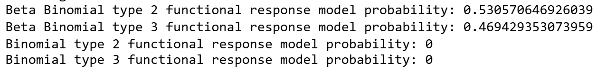
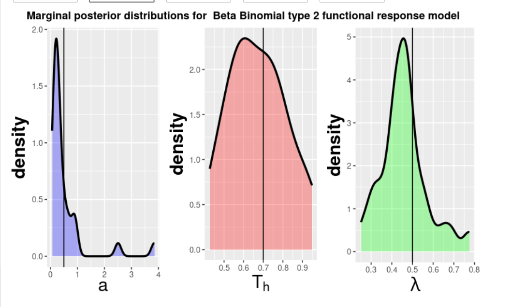
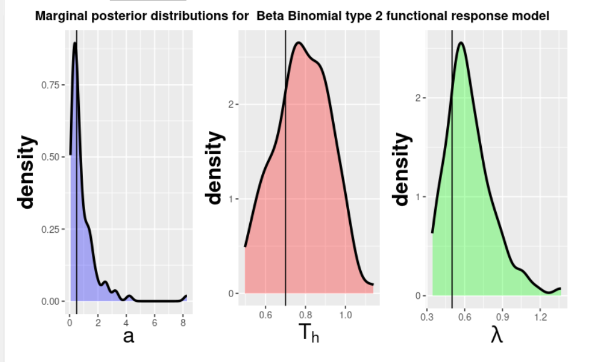
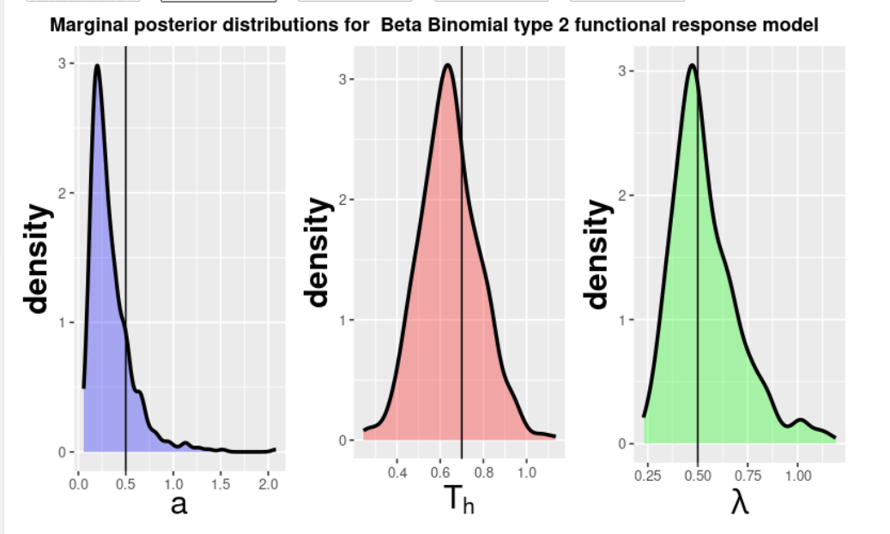
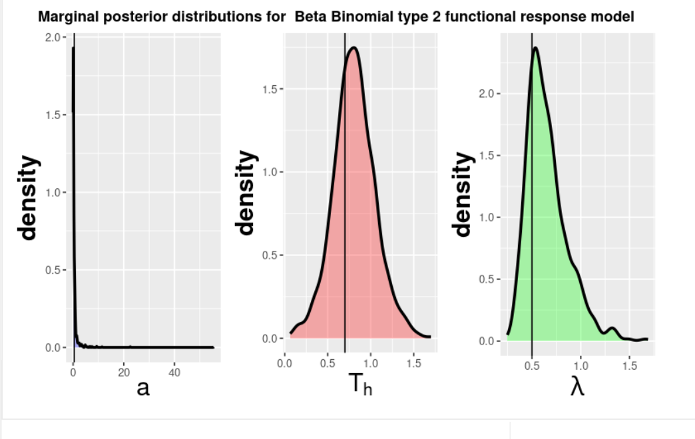

```{r setup, include=FALSE}
knitr::opts_chunk$set(echo = FALSE, message = FALSE, warning = FALSE, fig.align = 'center')
library(ggplot2)

```


# Motivation

Moffat et. al (2020) focuses on two predator-prey functional response models by C.S. Hollings, Type II and Type III.  
<span style="color: black">**Holling's Type II (Glutton):**
$$
\frac{dN}{dt} =  -\frac{aN}{1+aT_{h}N}
$$

<span style="color: black">**Holling's Type III (Learner):**
$$
\frac{dN}{dt} = -\frac{aN^2}{1+aT_{h}N^2}
$$

Both of these model the number of prey consumed in a given time interval, and take inputs of $N$ $=$ prey density, $a$ $=$ attack rate, and $T_{h}$ $=$ handling time, or the amount of time that the predator takes to pursue, subdue, and eat its prey. As N becomes increasingly large, these two models begin to appear identical. Moffat's study aims to provide an algorithm to simulate a range of experimental goals while acknowledging model structure uncertainty.

# Methodology
## Goal

The overarching goal of the sequential experimental design presented in this paper is to efficiently identify the correct functional response model and precisely estimate its parameters. Achieving this goal requires balancing statistical accuracy with computational feasibility.

## Challenge of Bayesian Inference 
The Sequential Experimental Design framework relies on Bayesian inference, which necessitates accurately tracking the posterior distribution of the model parameters. Calculating this high-dimensional posterior analytically is computationally intractable.Necessity of Simulation: To overcome this, the algorithm employs Sequential Monte Carlo (SMC) methods, which approximate the continuous posterior distribution using a discrete set of $\mathbf{N}$ particles.

## Experiment 1: Sensitivity Analysis 
The Particle Problem: The accuracy of this approximation, and thus the reliability of the entire sequential design, is directly tied to the number of particles, $N$.

Therefore we deployed a sensitivity analysis with the motivation to rigorously validate the selection of the particle count $N$ used by the authors ($\mathbf{N=500}$). 

The goal was to quantify and observe the trade-off between lower and higher, particle size, where lower particle quantities result in shorter compute time but unstable, low-resolution posterior distributions that yield unreliable sequential design choices. We hypothesized that while a statistically optimal $N$ value exists (yielding minimum noise), the practical choice ($\mathbf{N=500}$) must represent the highest particle count that is feasible within typical resource constraints.Therefore, we conducted a sensitivity analysis on $N \in \{30, 100, 500, 1000\}$ to examine the author's choice of $N = 500.$

## Qualitative Results

We focused our qualitative assessment on the Binomial Type 2 Model, as it was confirmed to be the most likely model by the highly stable $N=500$ and $N=1000$ runs as well as the original experiment results. The analysis of its marginal posteriors directly shows the convergence of the Law of Large Numbers towards the most likely model, demonstrated below by the probability output for N = 1000:

```{r, echo=FALSE, out.width="100%", fig.align='center', fig.cap= 'Figure 1'}

```
Below we will be comparing the plot output for each N value. 
First, we will start with N = 30:
```{r, echo=FALSE, out.width="100%", fig.align='center', fig.cap= 'N = 30 Type 2'}

```
Plots for N = 100:
```{r, echo=FALSE, out.width="100%", fig.align='center', fig.cap= 'N = 100 Type 2'}

```

Plots for N = 500:
```{r, echo=FALSE, out.width="100%", fig.align='center', fig.cap= 'N = 500 Type 2'}

```

Plots for N = 1000:
```{r, echo=FALSE, out.width="100%", fig.align='center', fig.cap= 'N = 1000 Type 2'}

```
## Decreasing Bumps and Tails (The Noise Reduction)
In the plots, the black vertical lines represent the true parameters, a, $T_{h}$, and $\lambda$, were kept at 0.5, 0.7, and 0.5, respectively. As $N$ increases, the distribution moves from being jagged and lumpy (high frequency of small bumps and irregular tails) to being smooth and clean (a single, well-defined curve), especially observed in the parameter, a, or attack rate. Low $N$ ($\le 100$): The bumps and irregular tails represent particle clustering and noise. Because there are so few particles, the kernel density estimator struggles to create a smooth curve, and the random clustering caused by the resampling step creates artifacts. This is an unstable, low-resolution approximation. High $N$ ($\ge 500$): The smooth curve confirms that the large number of particles is now providing a high-resolution and stable approximation of the true, smooth posterior distribution. Due to the random nature of the experiment with R being set to 0, there are still some observed artifacts in the tail of parameters like $\lambda$ in higher values of N, but the bumpiness 

## Increased Confidence/Narrowness (The Convergence)
While still not a perfect estimate of the true parameters, it appears that the algorithm is becoming more certain about the true parameter value. Precision: A higher, narrower peak indicates that the distribution's variance (spread) has decreased in the higher N values of N = 500 and N = 1000. 

After observing qualitative findings from the 4 different particle values, it is necessary to evaluate the quantitative compute time of each particle size.

## Compute time

```{r, echo=FALSE, out.width="100%", fig.align='center', fig.cap= 'Time To Compute Per Particle Size (N)'}
knitr::include_graphics("N size and computational time.png")
```


## Experiment 2: Determining the Best Method of Selecting Design Points

One of the components of the study involved looking at methods of choosing design points for a predator-prey experiment. Design points are simply the experimental conditions, and in this case, the initial number of prey. The authors lay out a total of six methods, but in this experiment, only two were explored with the addition of a new method. The first method (R=0) involves selecting a design point randomly every experiment, and the second (R=1) selects a design point that maximizes utility for parameter estimation. We introduced a third method (R=6), which involves selecting all of the design points for every experiment up-front. Under this method, design points can not be updated as experiments progress, but also better reflects realistic experimental design as researchers may need to know their resources and timelines before beginning their experimentation. 

For this experiment, the goal was to explore which of the three methods maximized the posterior probabilty for the true selected model, as well as best estimated the true parameters. The true model was set to Beta Binomial Type II (Model 1), and due the computational weight of method 1, the number of iterations was scaled down to 10, and the number of particles to 200. The true parameters for a, $T_{h}$, and $\lambda$, were kept at 0.5, 0.7, and 0.5, respectively. 


## Experiment 3: Two-step Move Step
  Sequential Monte Carlo involves taking weighted samples (particles) and iteratively changing them to more closely match a target distribution. To get a new posterior distribution for each iteration of Sequential Monte Carlo, each particle is re-weighted. These weights are often skewed, however, and the effective sample size is reduced. When the effective sample size is below a threshold (N/2 in the case of this study), it is best to re-sample and conduct a move step to diversify the particles, since duplicates often occur. The move step shifts particles according to probabilites in a Markov Chain Monte Carlo Kernel. Moffat et al. (2020) uses one move step, but outlines that is may be too few to diversify the particle set. The appropriate amount of times to conduct a move step for each particle is outlined as:
$$R_m \ge \frac{\log{c}}{\log{(1-p)}}$$
   where $c$ is a pre-selected probability for the particle to move and $p$ is acceptance probability. There are cases where this inequality is not true, and one move step is not sufficient. Thus, in this experiment, we study the effects of using two move steps after each re-sampling. We know that having two steps increases the uniqueness of the particle set and that the probability is greater for each particle to move with two rounds. Because of this, we aim to find whether diversifying the particles will improve the random models' posterior distributions.

# Results


## Results: Experiment 2

### Parameter Estimation

Figure 1 shows the marginal posterior distributions for each parameter under Model 1. 

```{r, echo=FALSE, out.width="100%", fig.align='center', fig.cap= 'Figure 1'}
knitr::include_graphics("plot_results.png")
```

Based on these plots, there appears to be little differences across methods in regards to how well each estimates the true parameters. Ideally, because method 1 selects design points with the intention of estimating parameters, it should result in the best estimation of those parameters. Apart from estimating parameter $\lambda$, the plots do not reflect this. This may be due to seed randomness, decreasing the particle size, or a combination of both. 

### Posterior Probability 

Figure N shows the posterior probabilty estimations under each method for Model 1 and Model 2, the beta binomial type II and type III, respectively. For model 3 and 4, the probabilities were approximately 0 for every method, so there were omitted to prevent redundancy. 
```{r, echo=FALSE, out.width="100%", fig.align='center', fig.cap = 'Figure 2'}
knitr::include_graphics("results_sum.png")
```

Ideally, if the design point selection method was efficient at discriminating against the wrong models, the value for the posterior probability for model 1 should be much higher than model 2. From these results, it appears that method 1 was the best at recovering the true model, while method 0 gave uninformative results, with the probabilties for model 1 and 2 be relatively similar. Lastly, method 6 performed very poorly, with this method recovering the wrong model. 

# References
Moffat Hayden, Hainy Markus, Papanikolaou Nikos E. and Drovandi Christopher 2020Sequential experimental design for predator–prey functional response experimentsJ. R. Soc. Interface.1720200156
http://doi.org/10.1098/rsif.2020.0156
