```{r setup, include=FALSE}
knitr::opts_chunk$set(echo = FALSE, message = FALSE, warning = FALSE, fig.align = 'center')
library(ggplot2)

```


# Motivation

Moffat et. al (2020) focuses on two predator-prey functional response models by C.S. Hollings, Type II and Type III.  
<span style="color: black">**Holling's Type II (Glutton):**
$$
\frac{dN}{dt} =  -\frac{aN}{1+aT_{h}N}
$$

<span style="color: black">**Holling's Type III (Learner):**
$$
\frac{dN}{dt} = -\frac{aN^2}{1+aT_{h}N^2}
$$

Both of these model the number of prey consumed in a given time interval, and take inputs of $N$ $=$ prey density, $a$ $=$ attack rate, and $T_{h}$ $=$ handling time, or the amount of time that the predator takes to pursue, subdue, and eat its prey. As N becomes increasingly large, these two models begin to appear identical. Moffat's study aims to provide an algorithm to simulate a range of experimental goals while acknowledging model structure uncertainty.

# Methodology
## Goal

The overarching goal of the sequential experimental design presented in this report is to efficiently identify the correct functional response model and precisely estimate its parameters. Achieving this goal requires balancing statistical accuracy with computational feasibility.

## Sequential Monte Carlo Algorithm

Throughout this report, Hayden Moffat's Sequential Monte Carlo algorithm in R was used. The algorithm starts but requiring the user to select true parameter values, true model, number of iterations, and particle size. Next, the user must also select the method of choosing design points. While Moffat's original manuscript lays out 6 different methods, this report focuses on two of these methods along with an additional third. The first method, method 0, also denoted as R=0, selects design points randomly every experiment. The second, method 1, selects design points that maximizes the utility for parameter estimation. The final method, method 6, was not included in Moffat's original design but rather added for the purposes of this project. This method selects all design points up front, not allowing updates as experiments progress. This method is the least flexible out of the three, but most realistically depicts real experimentation as researchers require their resources to be counted before beginning experiments. 

After selecting all of the above, the algorithm then draws particles from the prior distribution. Under each model, the algorithm simulates what would happen under the given design point, as well as compute the likelihood of that simulated outcome compared to the real data. Particles are then assigned weights based on their abilities to accurately describe the data. If particle weights become too concentrated, the algorithm performs a resampling move step to introduce diversity back into the particle set. Finally, the model probabilities are updated, and this process repeats under each model and iteration.  

## Challenge of Bayesian Inference 

The Sequential Experimental Design framework relies on Bayesian inference, which necessitates accurately tracking the posterior distribution of the model parameters. Calculating this high-dimensional posterior analytically is computationally intractable.Necessity of Simulation: To overcome this, the algorithm employs Sequential Monte Carlo (SMC) methods, which approximate the continuous posterior distribution using a discrete set of $\mathbf{N}$ particles.


# Experiment 1: Sensitivity Analysis 
The Particle Problem: The accuracy of this approximation, and thus the reliability of the entire sequential design, is directly tied to the number of particles, $N$.

Therefore we deployed a sensitivity analysis with the motivation to rigorously validate the selection of the particle count $N$ used by the authors ($\mathbf{N=500}$). 

The goal was to quantify and observe the trade-off between lower and higher, particle size, where lower particle quantities result in shorter compute time but unstable, low-resolution posterior distributions that yield unreliable sequential design choices. We hypothesized that while a statistically optimal $N$ value exists (yielding minimum noise), the practical choice ($\mathbf{N=500}$) must represent the highest particle count that is feasible within typical resource constraints.Therefore, we conducted a sensitivity analysis on $N \in \{30, 100, 500, 1000\}$ to examine the author's choice of $N = 500.$

## Qualitative Results

We focused our qualitative assessment on the Binomial Type 2 Model, as it was confirmed to be the most likely model by the highly stable $N=500$ and $N=1000$ runs as well as the original experiment results. The analysis of its marginal posteriors directly shows the convergence of the Law of Large Numbers towards the most likely model, demonstrated below by the probability output for N = 1000:

```{r, echo=FALSE, out.width="100%", fig.align='center', fig.cap= 'Figure 1'}
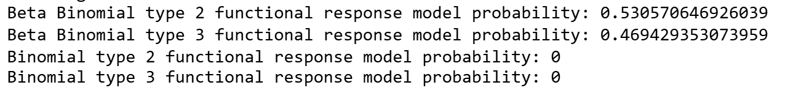
```
Below we will be comparing the plot output for each N value. 
First, we will start with N = 30:
```{r, echo=FALSE, out.width="100%", fig.align='center', fig.cap= 'N = 30 Type 2'}
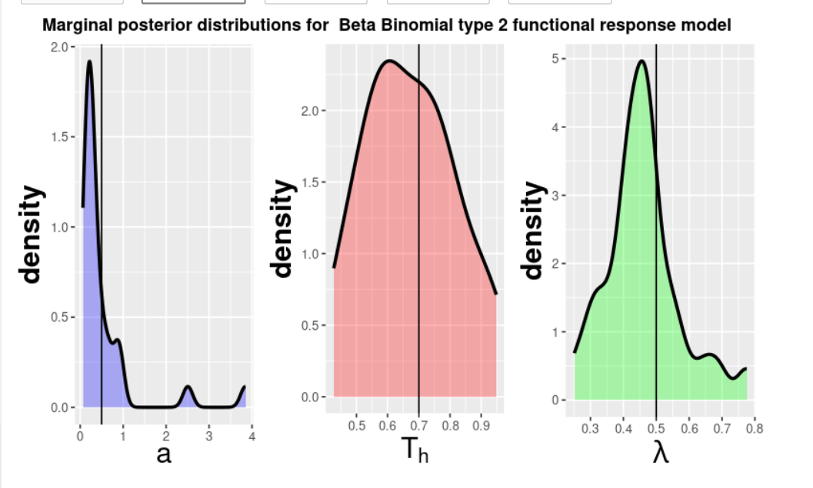
```
Plots for N = 100:
```{r, echo=FALSE, out.width="100%", fig.align='center', fig.cap= 'N = 100 Type 2'}
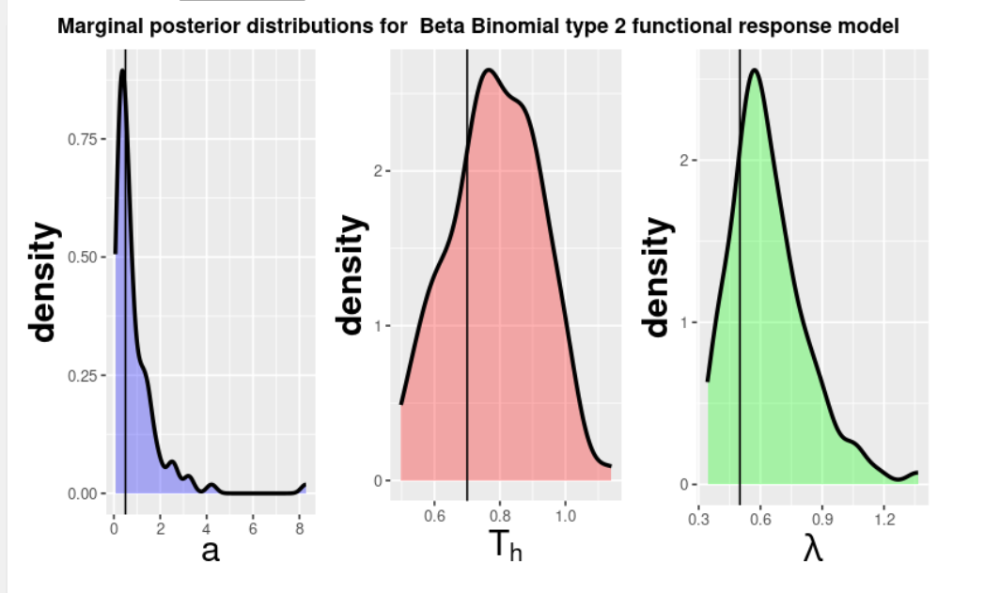
```

Plots for N = 500:
```{r, echo=FALSE, out.width="100%", fig.align='center', fig.cap= 'N = 500 Type 2'}
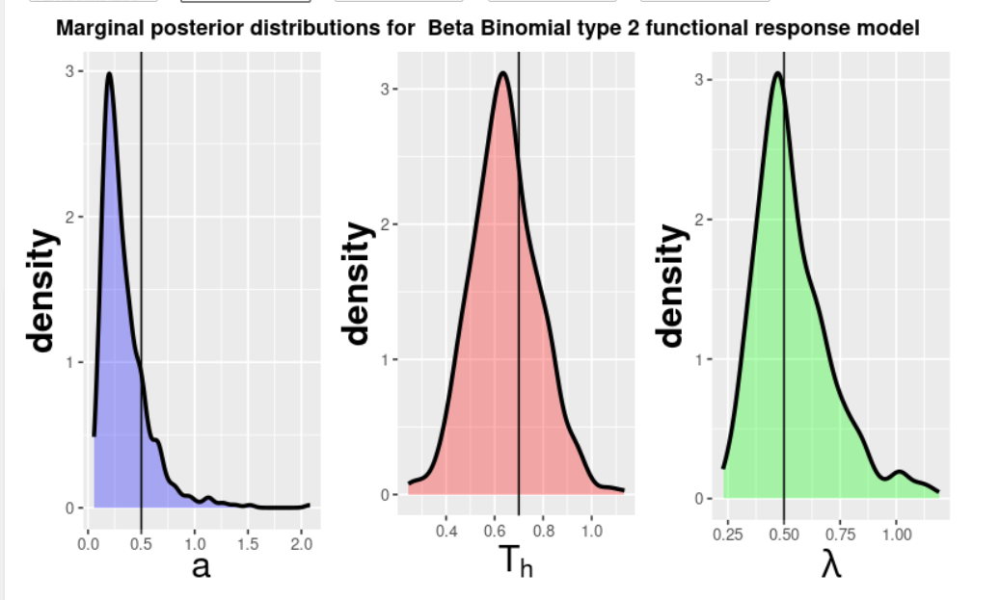
```

Plots for N = 1000:
```{r, echo=FALSE, out.width="100%", fig.align='center', fig.cap= 'N = 1000 Type 2'}
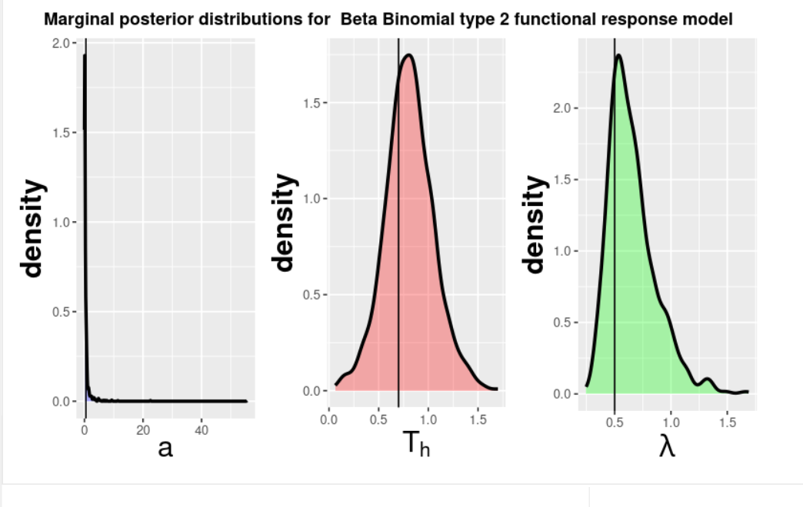
```
## Decreasing Bumps and Tails (The Noise Reduction)
In the plots, the black vertical lines represent the true parameters, a, $T_{h}$, and $\lambda$, were kept at 0.5, 0.7, and 0.5, respectively. As $N$ increases, the distribution moves from being jagged and lumpy (high frequency of small bumps and irregular tails) to being smooth and clean (a single, well-defined curve), especially observed in the parameter, a, or attack rate. Low $N$ ($\le 100$): The bumps and irregular tails represent particle clustering and noise. Because there are so few particles, the kernel density estimator struggles to create a smooth curve, and the random clustering caused by the resampling step creates artifacts. This is an unstable, low-resolution approximation. High $N$ ($\ge 500$): The smooth curve confirms that the large number of particles is now providing a high-resolution and stable approximation of the true, smooth posterior distribution. Due to the random nature of the experiment with R being set to 0, there are still some observed artifacts in the tail of parameters like $\lambda$ in higher values of N, but the bumpiness 

## Increased Confidence/Narrowness (The Convergence)
While still not a perfect estimate of the true parameters, it appears that the algorithm is becoming more certain about the true parameter value. Precision: A higher, narrower peak indicates that the distribution's variance (spread) has decreased in the higher N values of N = 500 and N = 1000. 

After observing qualitative findings from the 4 different particle values, it is necessary to evaluate the quantitative compute time of each particle size.

## Compute time

```{r, echo=FALSE, out.width="100%", fig.align='center', fig.cap= 'Time To Compute Per Particle Size (N)'}
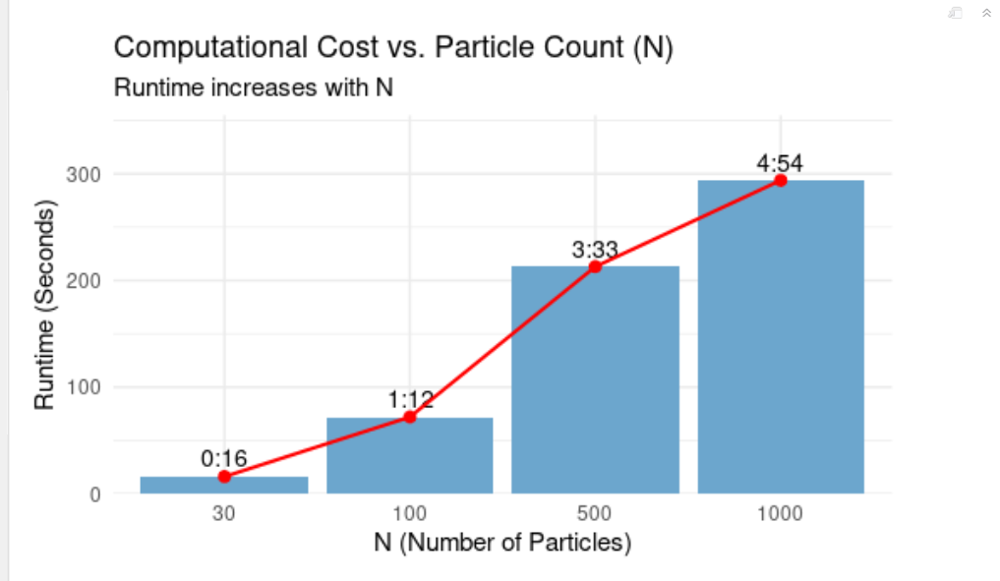
```

</br>


# Experiment 2: Determining the Best Method of Selecting Design Points

One of the components of the study involved looking at methods of choosing design points for a predator-prey experiment. Design points are simply the experimental conditions, and in this case, the initial number of prey. The authors lay out a total of six methods, but in this experiment, only two were explored with the addition of a new method. The first method (R=0) involves selecting a design point randomly every experiment, and the second (R=1) selects a design point that maximizes utility for parameter estimation. We introduced a third method (R=6), which involves selecting all of the design points for every experiment up-front. Under this method, design points can not be updated as experiments progress, but also better reflects realistic experimental design as researchers may need to know their resources and timelines before beginning their experimentation. 

For this experiment, the goal was to explore which of the three methods maximized the posterior probabilty for the true selected model, as well as best estimated the true parameters. The true model was set to Beta Binomial Type II (Model 1), and due the computational weight of method 1, the number of iterations was scaled down to 10, and the number of particles to 200. The true parameters for a, $T_{h}$, and $\lambda$, were kept at 0.5, 0.7, and 0.5, respectively. 

## Parameter Estimation

Figure 1 shows the marginal posterior distributions for each parameter under Model 1. 

```{r, echo=FALSE, out.width="100%", fig.align='center', fig.cap= 'Figure 1'}
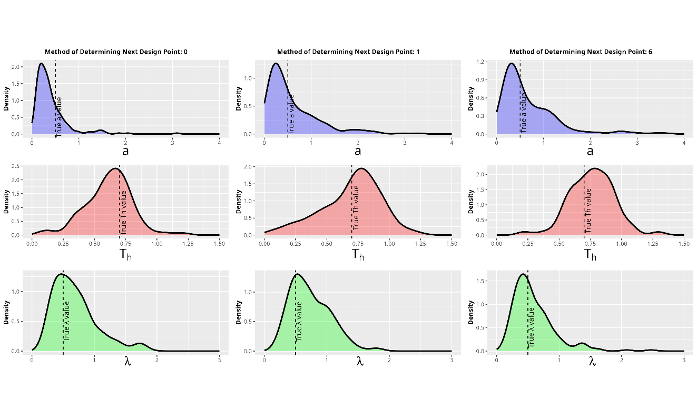
```

Based on these plots, there appears to be little differences across methods in regards to how well each estimates the true parameters. Ideally, because method 1 selects design points with the intention of estimating parameters, it should result in the best estimation of those parameters. Apart from estimating parameter $\lambda$, the plots do not reflect this. This may be due to seed randomness, decreasing the particle size, or a combination of both. 

## Posterior Probability 

Figure N shows the posterior probabilty estimations under each method for Model 1 and Model 2, the beta binomial type II and type III, respectively. For model 3 and 4, the probabilities were approximately 0 for every method, so there were omitted to prevent redundancy. 
```{r, echo=FALSE, out.width="100%", fig.align='center', fig.cap = 'Figure 2'}
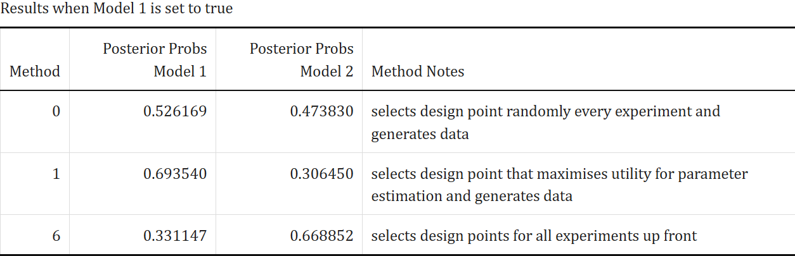
```

Ideally, if the design point selection method was efficient at discriminating against the wrong models, the value for the posterior probability for model 1 should be much higher than model 2. From these results, it appears that method 1 was the best at recovering the true model, while method 0 gave uninformative results, with the probabilities for model 1 and 2 being relatively similar. Lastly, method 6 performed very poorly, with this method recovering the wrong model. 


# Experiment 3: Two-step Move Step
  Sequential Monte Carlo involves taking weighted samples (particles) and iteratively changing them to more closely match a target distribution. To get a new posterior distribution for each iteration of Sequential Monte Carlo, each particle is re-weighted. These weights are often skewed, however, and the effective sample size is reduced. When the effective sample size is below a threshold (N/2 in the case of this study), it is best to re-sample and conduct a move step to diversify the particles, since duplicates often occur. The move step shifts particles according to probabilites in a Markov Chain Monte Carlo Kernel. Moffat et al. (2020) uses one move step, but outlines that is may be too few to diversify the particle set. The appropriate amount of times to conduct a move step for each particle is outlined as:
$$R_m \ge \frac{\log{c}}{\log{(1-p)}}$$
   where $c$ is a pre-selected probability for the particle to move and $p$ is acceptance probability. There are cases where this inequality is not true, and one move step is not sufficient. Thus, in this experiment, we study the effects of using two move steps after each re-sampling. We know that having two steps increases the uniqueness of the particle set and that the probability is greater for each particle to move with two rounds. Because of this, we aim to find whether diversifying the particles will improve the random models' posterior distributions.

## Results for Two-Step Move Step

  To evaluate if the performance of this model improves with two move steps, we are comparing the original model with one move step to our model with two move steps. In the interest of computational effort/time, only the binomial distributions under the random design point model are compared for type II and type III curves.

  Figures 9-12 present the marginal distributions for attack rate $a$, and handling time $T_h$, for predictions of the type II curve on the left, and the type III curve on the right. Within these marginal distributions, the true parameter value is represented by a vertical black line. The functional response model probabilities, which show which model is being predicted, is also given below each graph. Beta binomial model probabilities are included, but serve as a confirmation that the model is not predicting very poorly, as the values should always be low. Finally, the true model is given in each caption.

```{r, echo=FALSE, fig.align = "center", out.width = "48%", fig.show = "hold"}
knitr::include_graphics(c(
  "Original_Type_II_true_correct_graph.png",
  "Original_Type_II_true_false_graph.png"
))
```
```{r, echo=FALSE, fig.align = "center", out.width = "90%",fig.cap = "One-Step Move Step, Type II Curve as True Model."}
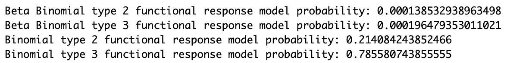
```

Under the original model in Figure 9, it is obvious that the model is predicting poorly. The true marginal distributions are not centered on the black line, and the functional response model probability is higher for the type III curve, which is the incorrect model. Without unique particles under a move step, the model could be pulled in directions that do not represent what is true. Especially under the random design point model, this is common, and presents a clear issue. 

```{r, echo=FALSE, fig.align = "center", out.width = "48%", fig.show = "hold"}
knitr::include_graphics(c(
  "Original_Type_III_true_false_graph.png",
  "Original_Type_III_true_ correct_graph.png"
))
```
```{r, echo=FALSE, fig.align = "center", out.width = "90%",fig.cap = "One-Step Move Step, Type III Curve as True Model."}
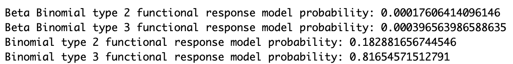
```

In Figure 10, we see good prediction for the true model. This was commonly the case for the type III curve, it seemed that the random model always leaned toward predicting the type III as true. 

```{r, echo=FALSE, fig.align = "center", out.width = "48%", fig.show = "hold"}
knitr::include_graphics(c(
  "Two_step_Type_II_true_correct_graph.png",
  "Two_step_Type_II_true_false_graph.png"
))
```
```{r, echo=FALSE, fig.align = "center", out.width = "90%",fig.cap = "Two-step Move Step, Type II Curve as True Model."}
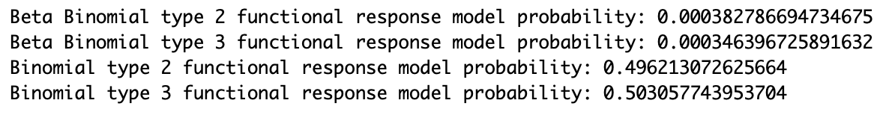
```

In Figure 11, under the two-step move step, we see improvements for the marginal distributions. The correct graphs peak around the true parameters, while the incorrect graphs do not. The functional response model probabilities are more even, but this is expected under the random model. 

```{r, echo=FALSE, fig.align = "center", out.width = "48%", fig.show = "hold"}
knitr::include_graphics(c(
  "Two_step_Type_III_true_false_graph.png",
  "Two_step_Type_III_true_correct_graph.png"
))
```
```{r, echo=FALSE, fig.align = "center", out.width = "90%",fig.cap = "Two-step Move Step, Type II Curve as True Model."}
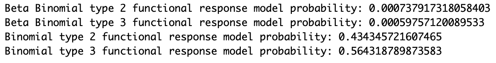
```

Finally, in Figure 12, all marginal distributions are well-centered around their true values. The functional response model probabilities are more even as well, but the type III model is still higher.

## Evaluation of Adding Move Steps

Overall, comparing the one-step to the two-step move steps, we see overall improvement in the random models' case. Because this is not influenced by a utility function like in Moffat et al. (2020), the functional response model probabilities are likely to be more even. In the one-step model, they are very large, which shows there is some influence that is creating bias. This is especially evident in Figure 9, where the true model is not predicted well, and the incorrect model is predicted at a much greater probability (0.785). The clearest improvements are in the marginal distributions for each parameter, however. Each distribution peaks around the true value for the true model that is being predicted.

With these model improvements, it naturally raises the question of why the original author did not incorporate multiple move steps. The obvious reason is that it takes more computational time. Running the move step algorithm extends each iteration already, so adding multiple steps increases the time even more. Since the original paper is focused on multiple models that are better at predictions and often take long to run anyway, using two move steps may not improve predictions in the more complex models enough to warrant making the process slower. Moffat et al. (2020) is also a study that is a first of its kind in this subject, and suggests ways it could be extended. Adding move steps is one of these suggestions, since one move step often does not diversify the particle set completely. 

In this study, we chose two move steps because it was enough to diversify the particle set completely. Each iteration under two move steps showed that the particle set of $N = 500$ was completely unique, while one move step commonly had cases with duplicate particles. Therefore, more than two move steps was never necessary, and would have only increased run-time. Due to this, we believe that using two move steps is the best approach in this algorithm, and if computational time is not an issue, future use of this algorithm should employ the use of two move steps to reduce bias in each iteration. 


# References
Moffat Hayden, Hainy Markus, Papanikolaou Nikos E. and Drovandi Christopher 2020Sequential experimental design for predator–prey functional response experimentsJ. R. Soc. Interface.1720200156
http://doi.org/10.1098/rsif.2020.0156
