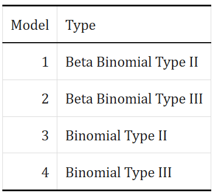
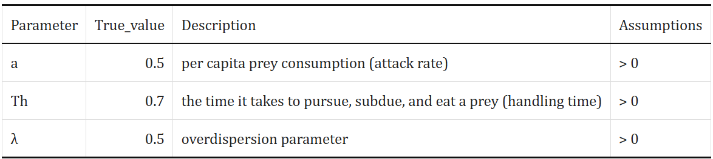
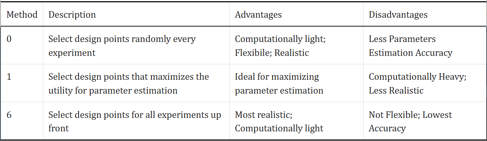
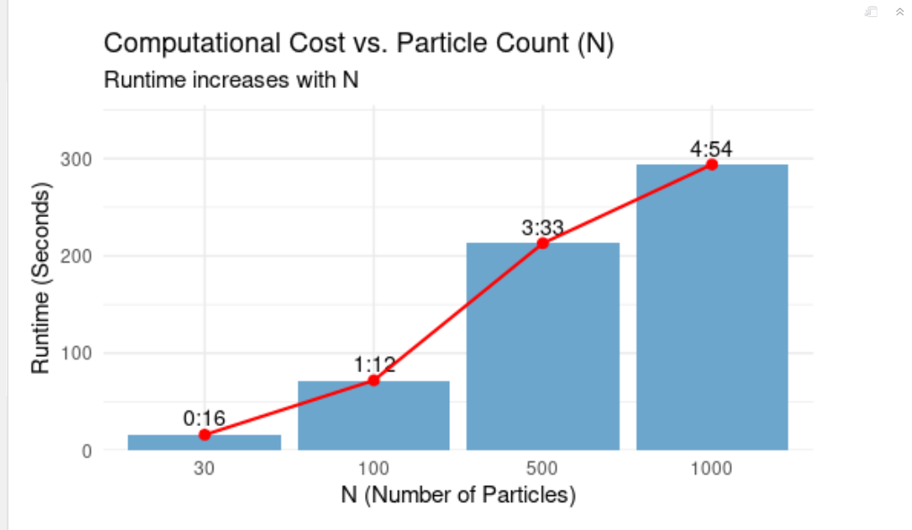
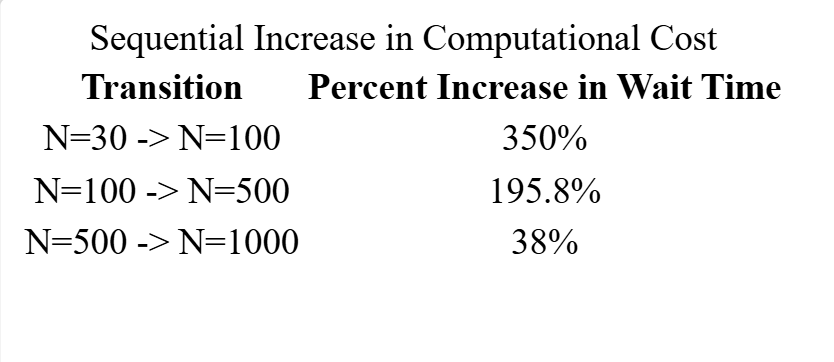
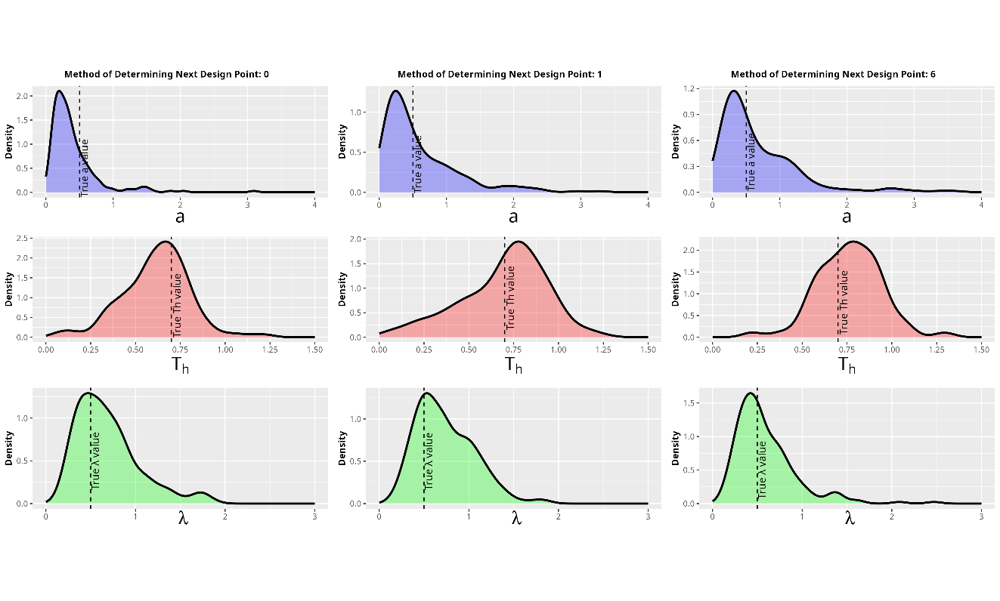
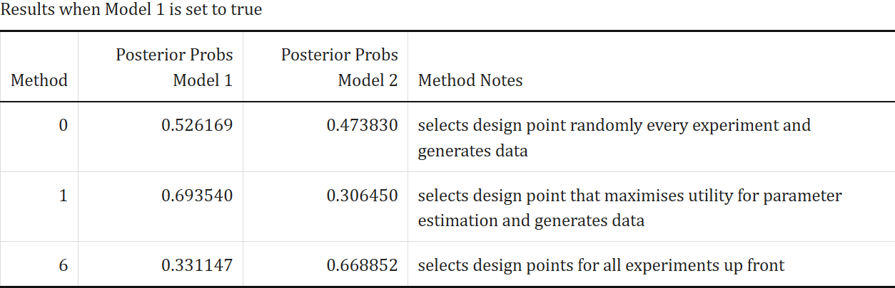

```{r setup, include=FALSE}
knitr::opts_chunk$set(echo = FALSE)
```

## Motivation: The Ecological Problem

<div style="font-size: 28px; line-height: 1.5;">

**How do predators respond to prey density?**

* <span style="color: blue">**Holling's Type II (Glutton):**</span> Eats fast, gets full quickly.
$$
\frac{dN}{dt} =  -\frac{aN}{1+aT_{h}N}
$$
* <span style="color: red">**Holling's Type III (Learner):**</span> Slow start (learning), accelerates, then gets full.
$$
\frac{dN}{dt} = -\frac{aN^2}{1+aT_{h}N^2}
$$

where N = prey density,
      a = attack rate,
      $T_{h}$ = handling time


## Visualizing the Challenge

**The Issue:** These biological behaviors look mathematically identical at high prey densities.

```{r, echo=FALSE, out.width="60%", fig.align='center'}
knitr::include_graphics("Statistical Challenge.png")
```


## Study Background

**Before Starting Experiment**: 

<div style= "float:right;position: relative; left: 40px; top: -7px;">
```{r echo=FALSE, out.width="300px", fig.align='left'}

 

```
</div>

* Select a true model, this is the distribution that will be used to sample the number of prey consumed.

* Select true values for the parameters

* Select the number of iterations (I = 25), particles (N = 500), and time (t = 24 hrs)

```{r, echo=FALSE, out.width="80%", fig.align='left'}

```

## Sequential Bayesian Framework



1) Start with a design point (experiment), which contains the conditions of a single experiment.

2) Draw parameter samples (particles) from the prior distributions

3) Simulate data under each model at that selected design point

4) Compute likelihoods for each model given the simulated data.

5) Update particle weights, and resample if effective sample size (ESS) is below the threshold N/2. ESS is a measure of of the efficiency of a particle set.

5) Update model probabilities and repeat

## Sensitivity Analysis of Particle Count in SMC

**Goal**: Determine the computational efficiency of author's original choice of N = 500 by analyzing cost-benefit trade-off.

* Sequential Monte Carlo methods approximate the parameter posterior distributions using particles. 

* SMC requires a sufficient number of particles (N) to minimize the Monte Carlo Variance without causing excessive computational cost, or runtime.

## Experiment Set Up

Computed marginal posterior distributions for:
* Binomial and beta binomial 
* Type 2 and Type 3 functional response modes.

* Kept design strategy constant at R = 0 (random design) to isolate effect of particle count N from the sequential design choices.

* Tested four discrete particle counts: 

$$N \in \{30, 100, 500 \text{ (Author's Choice)}, 1000\}$$

* Due to high computational costs, we only performed a Single-Run Sensitivity Analysis. We will be looking at runtime vs. posterior smoothness results. 


## Qualitative Results: N = 30 versus N = 500

<div class="columns">

<div class="column" style="width:49%;">
<h4 style="text-align: center;">N = 30</h4>

</div>

<div class="column" style="width:49%;">
<h4 style="text-align: center;">N = 500</h4>


</div>

Highly unreliable estimates for N = 30 and multi peaked


## Qualitative Results: N = 100 versus N = 500 
<div class="column" style="width:49%;">
<h4 style="text-align: center;">N = 100</h4>

</div>

<div class="column" style="width:49%;">
<h4 style="text-align: center;">N = 500</h4>

</div>

</div>

Improved smoothness for N = 100, still small bumps in the tails

## Qualitative Results: N = 1000 versus N = 500 
<div class="column" style="width:49%;">
<h4 style="text-align: center;">N = 1000</h4>

</div>

<div class="column" style="width:49%;">
<h4 style="text-align: center;">N = 500</h4>

</div>

</div>

N = 1000 has smoothest distributions, due to the Law of Large Numbers dictating that as N increases, the Monte Carlo variance decreases. We can be confident that N = 1000 and N = 500 are the statistically stable options, but have to take into account computation cost.


## Comparing Run Time 

```{r, echo=FALSE, out.width="50%", fig.align='center'}

```

```{r, echo=FALSE, out.width="50%", fig.align='center'}

```

## **Overall** 
For maximal statistical reliability, N = 1000 is desired. But due to computational constraints as well as changes in design (where R is not 0 or random), the author's choice of N = 500 seems like a pragmatic computational compromise. 


## Setup For Determining Best Experimental Design

**Goal**: Explore the best method for determining experimental design points that maximize posterior probability for true model and accurately estimates the true parameters.

* Due to computational complexity with method 1, the number of iterations and particles were scaled down to 10 and 200, respectively. 

* All 3 methods were tested, with the standard true parameters.

* For this experiment, Model 1 was selected as the true model

## Results - Visual

Marginal Posterior Distributions for Beta Binomial Type 2 Functional Response
```{r, echo=FALSE, out.width="100%", fig.align='center'}

```

## Results - Quantitative

```{r, echo=FALSE, out.width="100%", fig.align='center'}

```

**Overall**: 

* All methods appeared to have relatively similar accuracy when estimating the true parameters

* Method 1 best recovers the true model, Method 0 is uninformative, and Method 6 performed poorly


## Why Move Steps are Used
* Sequential Monte Carlo involves taking weighted samples (particles) and iteratively changing them to more closely match a target distribution.

* To get a new posterior distribution for each iteration of Sequential Monte Carlo, each particle is re-weighted. However, these weights are often skewed, and the effective sample size is reduced. 

* When the effective sample size is below a threshold, it is best to re-sample and conduct a move step to diversify the particles, since duplicates often occur. 
* Moffat et al. (2020) uses one move step, but outlines that is may be too few to diversify the particle set. Thus, we explore using two.


## Two-Step Move Step

* The appropriate amount of times to conduct a move step for each particle is outlined as:
$$R_m \ge \frac{\log{c}}{\log{(1-p)}}$$
   where $c$ is a pre-selected probability for the particle to move and $p$ is acceptance probability.
   
* We know that having two steps increases the uniqueness of the particle set.

* We know that the probability is greater for each particle to move with two rounds
   
* We aim to find whether diversifying the particles will improve the random models' posterior distributions.

## One Step with Type II as True Model

<table style="width:100%; text-align:center;">
  <tr>
    <td style="width:50%;"></td>
    <td style="width:50%;"></td>
  </tr>
  <tr>
    <td colspan="2" style="text-align:center;">
      
    </td>
  </tr>
</table>


* The model of the Type II response (true) is on the left and the model of the Type III (false) response is on the right.

## One Step with Type III as True Model

<table style="width:100%; text-align:center;">
  <tr>
    <td style="width:50%;"></td>
    <td style="width:50%;"></td>
  </tr>
  <tr>
    <td colspan="2" style="text-align:center;">
      
    </td>
  </tr>
</table>


* The model of the Type II response (false) is on the left and the model of the Type III (true) response is on the right.

## Two Steps with Type II as True Model

<table style="width:100%; text-align:center;">
  <tr>
    <td style="width:50%;"></td>
    <td style="width:50%;"></td>
  </tr>
  <tr>
    <td colspan="2" style="text-align:center;">
      
    </td>
  </tr>
</table>


* The model of the Type II response (true) is on the left and the model of the Type III (false) response is on the right.

## Two Steps with Type III as True Model

<table style="width:100%; text-align:center;">
  <tr>
    <td style="width:50%;"></td>
    <td style="width:50%;"></td>
  </tr>
  <tr>
    <td colspan="2" style="text-align:center;">
      
    </td>
  </tr>
</table>


* The model of the Type II response (false) is on the left and the model of the Type III (true) response is on the right.

## Take Aways

* It appears that overall, having two steps helps the distributions match their true posteriors more accurately.

* Moffat et al., (2020) explores much better approaches, but these are very expensive. This approach likely increases significantly.


