```{r setup, include=FALSE}
knitr::opts_chunk$set(echo = FALSE)
```

## Motivation: The Ecological Problem

<div style="font-size: 28px; line-height: 1.5;">

**How do predators respond to prey density?**

* <span style="color: blue">**Type II (Glutton):**</span> Eats fast, gets full quickly.
$$
\frac{dN}{dt} =  -\frac{aN}{1+aT_{h}N}
$$
* <span style="color: red">**Type III (Learner):**</span> Slow start (learning), accelerates, then gets full.
$$
\frac{dN}{dt} = -\frac{aN^2}{1+aT_{h}N^2}
$$

where N = prey density,
      a = attack rate,
      $T_{h}$ = handling time
      


## Visualizing the Challenge

**The Issue:** These biological behaviors look mathematically identical at high prey densities.

```{r, echo=FALSE, out.width="60%", fig.align='center'}
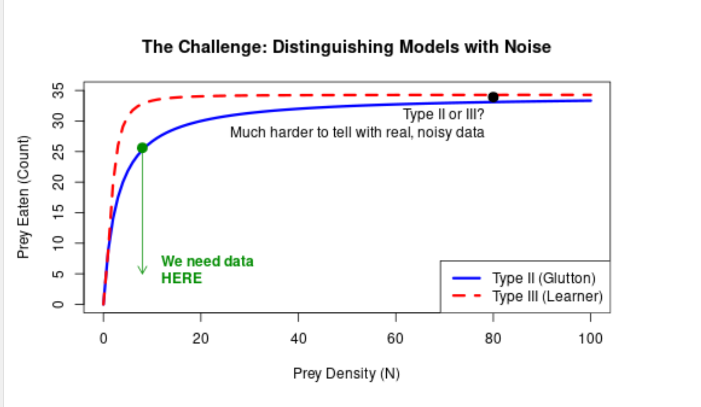
```

**The Goal:** Distinguish the correct model using the fewest experiments possible. 


## Slide 2: The Results - Juliette

Stuff blah blah plus loading in graphs after downloading them

## Slide 3: The Results - Mia


## Why Move Steps are Used
* Sequential Monte Carlo involves taking weighted samples (particles) and iteratively changing them to more closely match a target distribution.

* To get a new posterior distribution for each iteration of Sequential Monte Carlo, each particle is re-weighted. However, these weights are often skewed, and the effective sample size is reduced. 

* When the effective sample size is below a threshold, it is best to re-sample and conduct a move step to diversify the particles, since duplicates often occur. 
* Moffat et al. (2020) uses one move step, but outlines that is may be too few to diversify the particle set. Thus, we explore using two.


## Two-Step Move Step

* The appropriate amount of times to conduct a move step for each particle is outlined as:
$$R_m \ge \frac{\log{c}}{\log{(1-p)}}$$
   where $c$ is a pre-selected probability for the particle to move and $p$ is acceptance probability.
   
* We know that having two steps increases the uniqueness of the particle set.

* We know that the probability is greater for each particle to move with two rounds
   
* We aim to find whether diversifying the particles will improve the random models' posterior distributions.

## One Step with Type II as True Model

<table style="width:100%; text-align:center;">
  <tr>
    <td style="width:50%;">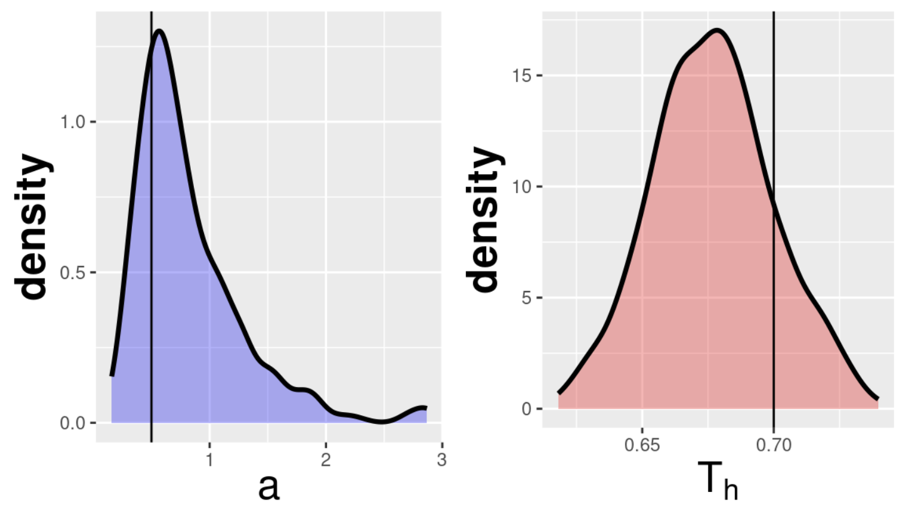</td>
    <td style="width:50%;">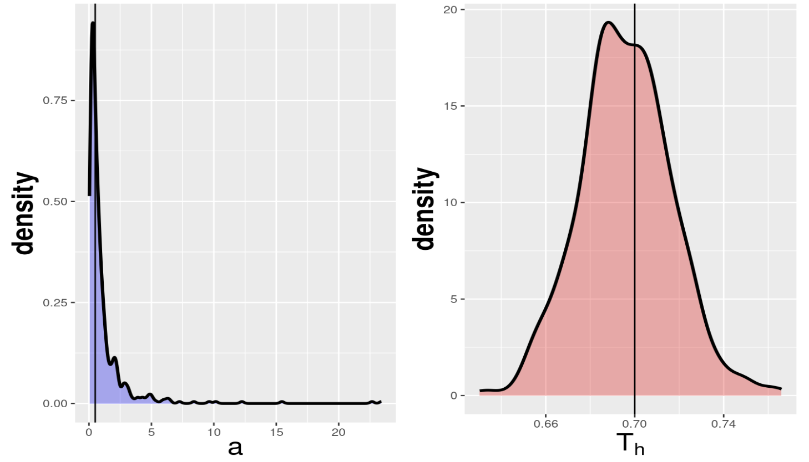</td>
  </tr>
  <tr>
    <td colspan="2" style="text-align:center;">
      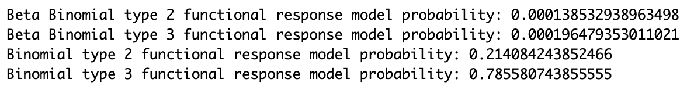
    </td>
  </tr>
</table>


* The model of the Type II response (true) is on the left and the model of the Type III (false) response is on the right.

## One Step with Type III as True Model

<table style="width:100%; text-align:center;">
  <tr>
    <td style="width:50%;">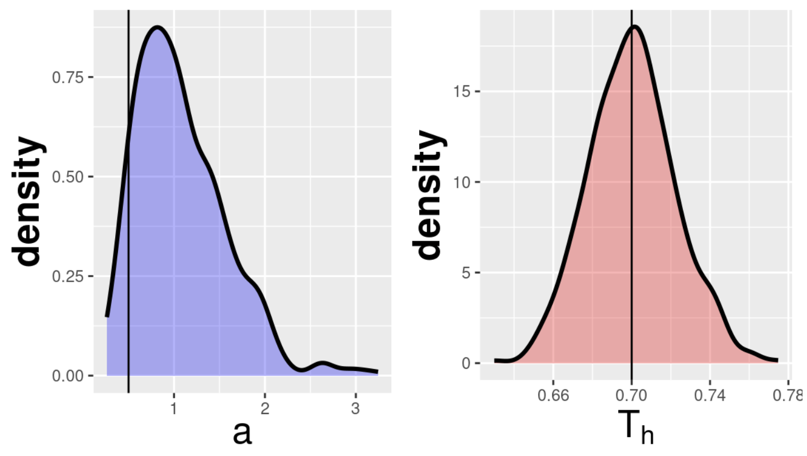</td>
    <td style="width:50%;"></td>
  </tr>
  <tr>
    <td colspan="2" style="text-align:center;">
      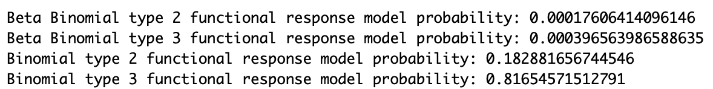
    </td>
  </tr>
</table>


* The model of the Type II response (false) is on the left and the model of the Type III (true) response is on the right.

## Two Steps with Type II as True Model

<table style="width:100%; text-align:center;">
  <tr>
    <td style="width:50%;">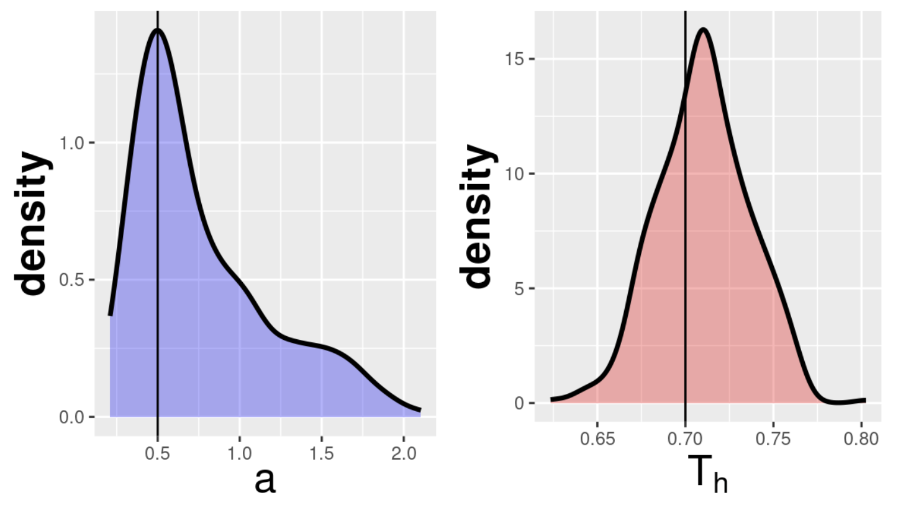</td>
    <td style="width:50%;">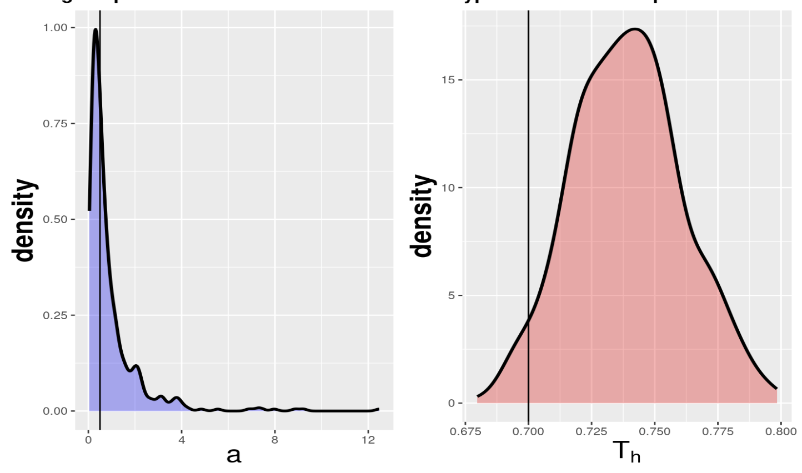</td>
  </tr>
  <tr>
    <td colspan="2" style="text-align:center;">
      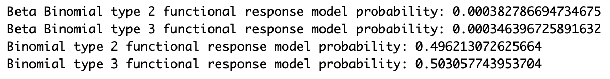
    </td>
  </tr>
</table>


* The model of the Type II response (true) is on the left and the model of the Type III (false) response is on the right.

## Two Steps with Type III as True Model

<table style="width:100%; text-align:center;">
  <tr>
    <td style="width:50%;">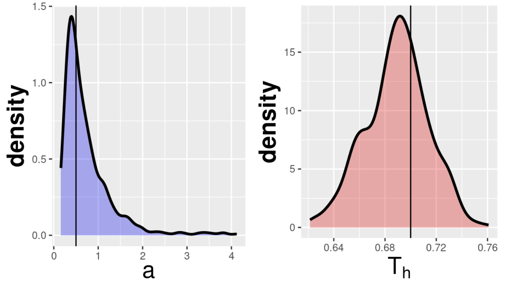</td>
    <td style="width:50%;">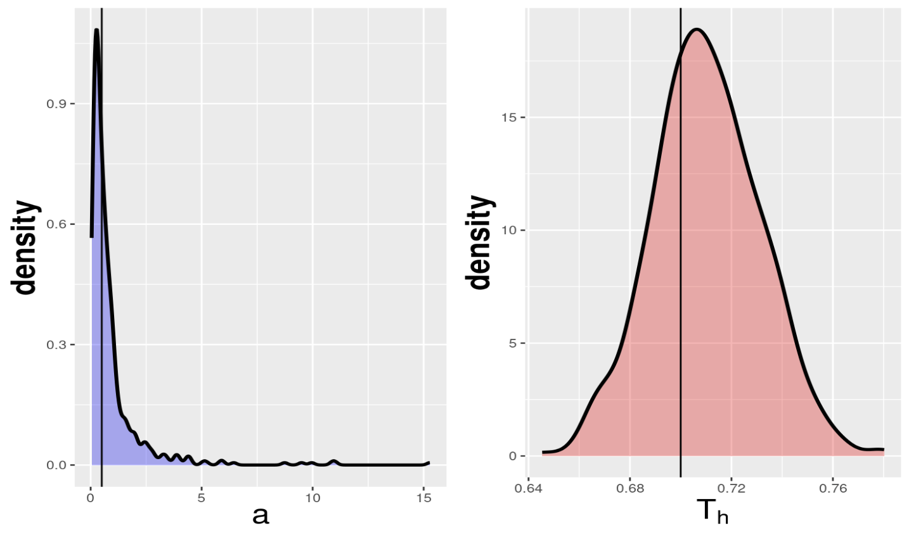</td>
  </tr>
  <tr>
    <td colspan="2" style="text-align:center;">
      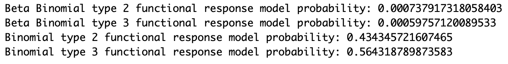
    </td>
  </tr>
</table>


* The model of the Type II response (false) is on the left and the model of the Type III (true) response is on the right.

## What Does This Mean?

* It appears that overall, having two steps improves the distributions match their true posteriors.

* Moffat et al., (2020) explores much better approaches, but these are very expensive.

* Because these particles are drawn randomly, having two steps should help keep them from pulling distributions in the wrong direction.

## Slide 5: Conclusion
